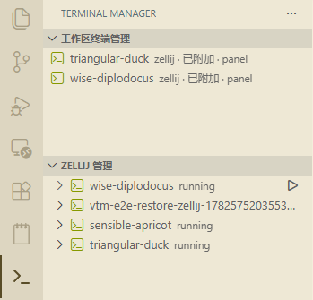

# VS Code Terminal Manager

一个 VS Code 侧边栏扩展，用三个原生 TreeView 管理：



- 工作区终端管理：只记住从当前工作区管理的 tmux/zellij 会话终端，保存名称、cwd、shell、panel/editor 创建位置、会话名和最近 shell 命令。重新打开工作区时默认按原位置自动附加这些终端。普通 VS Code 终端由 VS Code 自带终端面板管理，不进入本扩展视图。
- Zellij 管理：列出 zellij 会话，支持新建、附加、结束、删除和自动刷新。
- Tmux 管理：列出 tmux session/window/pane 树，支持新建、附加、重命名、窗口/面板操作、结束和自动刷新。

## 使用

```bash
npm install
npm run compile
npm run e2e
```

命令行打开扩展开发宿主：

```bash
npm run start
```

VS Code 调试：用 VS Code 打开本目录，选择 `Debug VS Code Terminal Manager Extension`，按 F5。

## 配置

- `vscodeTerminalManager.autoAttachRememberedTerminals`: 默认 `true`，打开工作区时自动附加已记住的 tmux/zellij 会话终端。
- `vscodeTerminalManager.autoSaveIntervalMs`: 默认 `3000`，已记住会话终端的状态保存间隔。
- `vscodeTerminalManager.autoRefreshIntervalMs`: 默认 `3000`，tmux/zellij TreeView 自动刷新间隔。
- `vscodeTerminalManager.logToOutput`: 默认 `true`，把诊断 JSONL 同步到 Output Channel。

## E2E

模板仓库的 WebdriverIO 方案保留在本项目中：

```bash
npm run e2e
npm run e2e:trace
npm run artifacts:latest
```

每次运行都会写入 `e2e/artifacts/<run-id>/`，包括 UI 截图、DOM/样式快照、命令 JSONL、测试结果 JSONL、VS Code storage 和扩展侧 `extension-events.jsonl`。

测试会打开 Terminal Manager 侧边栏，验证三个 TreeView 的 UI 可见性，读取扩展运行状态，并在环境安装了 `tmux`/`zellij` 时创建和清理真实会话。
